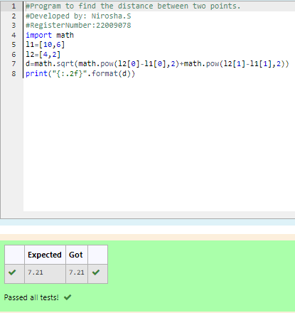

# DISTANCE-BETWEEN-TWO-POINTS

## AIM:
To write a python program to find the distance two 2 points
## ALGORITHM:

### Step 1:
Get the value from the user 
### Step 2:
Assign the values
### Step 3:
Substitute the values in the distance formula  
### Step 4: 
print the result
### Step 5:
End the program
### PROGRAM:
```python
#Program to find the distance between two points.
#Developed by: Nirosha.S
#RegisterNumber:22009078
import math
l1=[10,6]
l2=[4,2]
d=math.sqrt(math.pow(l2[0]-l1[0],2)+math.pow(l2[1]-l1[1],2))
print("{:.2f}".format(d))
```
### OUTPUT:

### RESULT:
Thus distance of the points created successfully
